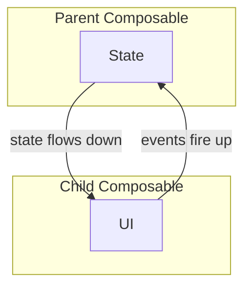
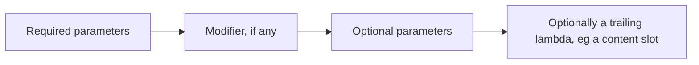

## State

### Hoist all the things

Compose is built upon the idea of [unidirectional data flow](https://developer.android.com/jetpack/compose/state#state-hoisting): data/state flows down, and events fire up. To achieve this, Compose advocates for [hoisting state](https://developer.android.com/jetpack/compose/state#state-hoisting) upwards, making most composable functions stateless. This has many benefits, including easier testing.



In practice, watch out for these common issues:

- Do not pass ViewModels (or objects from DI) down.
- Do not pass `MutableState<T>` instances down.
- Do not pass inherently mutable types that cannot be observed.

Instead, pass the relevant data to the function and use lambdas for callbacks.

More information: [State and Jetpack Compose](https://developer.android.com/jetpack/compose/state)

!!! info ""

    :material-chevron-right-box: [compose:vm-forwarding-check](https://github.com/mrmans0n/compose-rules/blob/main/rules/common/src/main/kotlin/io/nlopez/compose/rules/ViewModelForwarding.kt) ktlint :material-chevron-right-box: [ViewModelForwarding](https://github.com/mrmans0n/compose-rules/blob/main/rules/common/src/main/kotlin/io/nlopez/compose/rules/ViewModelForwarding.kt) detekt

### State should be remembered in composables

Be careful when using `mutableStateOf` (or any of the other `State<T>` builders) to make sure that you `remember` the instance. If you don't `remember` the state instance, a new state instance will be created when the function is recomposed.

!!! info ""

    :material-chevron-right-box: [compose:remember-missing-check](https://github.com/mrmans0n/compose-rules/blob/main/rules/common/src/main/kotlin/io/nlopez/compose/rules/RememberStateMissing.kt) ktlint :material-chevron-right-box: [RememberMissing](https://github.com/mrmans0n/compose-rules/blob/main/rules/common/src/main/kotlin/io/nlopez/compose/rules/RememberStateMissing.kt) detekt

### Use mutableStateOf type-specific variants when possible

Compose provides type-specific state variants that avoid autoboxing on JVM platforms, making them more memory efficient. Use these instead of `mutableStateOf` when working with primitives or primitive collections.

**Primitives:**

| Instead of | Use |
|:-----------|:----|
| `mutableStateOf<Int>` | `mutableIntStateOf` |
| `mutableStateOf<Long>` | `mutableLongStateOf` |
| `mutableStateOf<Float>` | `mutableFloatStateOf` |
| `mutableStateOf<Double>` | `mutableDoubleStateOf` |

**Primitive Lists:**

| Instead of | Use |
|:-----------|:----|
| `mutableStateOf(List<Int>)` | `mutableIntListOf` |
| `mutableStateOf(List<Long>)` | `mutableLongListOf` |
| `mutableStateOf(List<Float>)` | `mutableFloatListOf` |

**Primitive Sets:**

| Instead of | Use |
|:-----------|:----|
| `mutableStateOf(Set<Int>)` | `mutableIntSetOf` |
| `mutableStateOf(Set<Long>)` | `mutableLongSetOf` |
| `mutableStateOf(Set<Float>)` | `mutableFloatSetOf` |

**Primitive Maps:**

| Instead of | Use |
|:-----------|:----|
| `mutableStateOf(Map<Int, Int>)` | `mutableIntIntMapOf` |
| `mutableStateOf(Map<Int, Long>)` | `mutableIntLongMapOf` |
| `mutableStateOf(Map<Int, Float>)` | `mutableIntFloatMapOf` |
| `mutableStateOf(Map<Long, Int>)` | `mutableLongIntMapOf` |
| `mutableStateOf(Map<Long, Long>)` | `mutableLongLongMapOf` |
| `mutableStateOf(Map<Long, Float>)` | `mutableLongFloatMapOf` |
| `mutableStateOf(Map<Float, Int>)` | `mutableFloatIntMapOf` |
| `mutableStateOf(Map<Float, Long>)` | `mutableFloatLongMapOf` |
| `mutableStateOf(Map<Float, Float>)` | `mutableFloatFloatMapOf` |

The collection variants also apply to `PersistentList`, `ImmutableList`, `PersistentSet`, `ImmutableSet`, `PersistentMap`, and `ImmutableMap`.

!!! info ""

    :material-chevron-right-box: [compose:mutable-state-autoboxing](https://github.com/mrmans0n/compose-rules/blob/main/rules/common/src/main/kotlin/io/nlopez/compose/rules/MutableStateAutoboxing.kt) ktlint :material-chevron-right-box: [MutableStateAutoboxing](https://github.com/mrmans0n/compose-rules/blob/main/rules/common/src/main/kotlin/io/nlopez/compose/rules/MutableStateAutoboxing.kt) detekt

## Composables

### Do not use inherently mutable types as parameters

This follows from the "Hoist all the things" rule above. While it might be tempting to pass mutable state down to a function, this is an anti-pattern that breaks unidirectional data flow. Mutations are events that should be modeled as lambda callbacks in the function API.

The main issue is that mutable objects often don't trigger recomposition. Without recomposition, your composables won't automatically update to reflect the new value.

Common examples include passing `ArrayList<T>` or `ViewModel`, but this applies to any mutable type.

!!! info ""

    :material-chevron-right-box: [compose:mutable-params-check](https://github.com/mrmans0n/compose-rules/blob/main/rules/common/src/main/kotlin/io/nlopez/compose/rules/MutableParameters.kt) ktlint :material-chevron-right-box: [MutableParams](https://github.com/mrmans0n/compose-rules/blob/main/rules/common/src/main/kotlin/io/nlopez/compose/rules/MutableParameters.kt) detekt

### Do not use MutableState as a parameter

Using `MutableState<T>` as a parameter promotes shared ownership of state between a component and its caller.

Instead, make the component stateless and let the caller handle state changes. If the component needs to mutate the parent's property, consider creating a `ComponentState` class with a domain-specific field backed by `mutableStateOf(...)`.

When a component accepts `MutableState` as a parameter, it can change it at will. This splits state ownership, and the caller loses control over how and when the state changes.

More info: [Compose API guidelines](https://android.googlesource.com/platform/frameworks/support/+/androidx-main/compose/docs/compose-component-api-guidelines.md#mutablestate_t_as-a-parameter)

!!! info ""

    :material-chevron-right-box: [compose:mutable-state-param-check](https://github.com/mrmans0n/compose-rules/blob/main/rules/common/src/main/kotlin/io/nlopez/compose/rules/MutableStateParameter.kt) ktlint :material-chevron-right-box: [MutableStateParam](https://github.com/mrmans0n/compose-rules/blob/main/rules/common/src/main/kotlin/io/nlopez/compose/rules/MutableStateParameter.kt) detekt

### Be mindful of effect keys

In Compose, effects like `LaunchedEffect`, `produceState`, and `DisposableEffect` use keys to control when they restart:

```kotlin
EffectName(key1, key2, key3, ...) { block }
```

Using the wrong keys can cause:

- **Bugs** if the effect restarts less often than needed.
- **Inefficiency** if the effect restarts more often than necessary.

To ensure proper behavior:

- Include variables used in the effect block as key parameters.
- Use `rememberUpdatedState` to prevent unnecessary restarts when you don't want to restart the effect (e.g., inside a flow collector).
- Variables that never change (via `remember` with no keys) don't need to be passed as effect keys.

Here are some examples:

```kotlin
// ❌ onClick changes, but the effect won't be pointing to the right one!
@Composable
fun MyComposable(onClick: () -> Unit) {
    LaunchedEffect(Unit) {
        delay(10.seconds) // something that takes time, a flow collection, etc
        onClick()
    }
    // ...
}
// ✅ onClick changes and the LaunchedEffect won't be rebuilt -- but will point at the correct onClick!
@Composable
fun MyComposable(onClick: () -> Unit) {
    val latestOnClick by rememberUpdatedState(onClick)
    LaunchedEffect(Unit) {
        delay(10.seconds) // something that takes time, a flow collection, etc
        latestOnClick()
    }
    // ...
}
// ✅ _If we don't care about rebuilding the effect_, we can also use the parameter as key
@Composable
fun MyComposable(onClick: () -> Unit) {
    // This effect will be rebuilt every time onClick changes, so it will always point to the latest one.
    LaunchedEffect(onClick) {
        delay(10.seconds) // something that takes time, a flow collection, etc
        onClick()
    }
}
```

More info: [Restarting effects](https://developer.android.com/jetpack/compose/side-effects#restarting-effects) and [rememberUpdatedState](https://developer.android.com/jetpack/compose/side-effects#rememberupdatedstate)

!!! info ""

    :material-chevron-right-box: [compose:lambda-param-in-effect](https://github.com/mrmans0n/compose-rules/blob/main/rules/common/src/main/kotlin/io/nlopez/compose/rules/LambdaParameterInRestartableEffect.kt) ktlint :material-chevron-right-box: [LambdaParameterInRestartableEffect](https://github.com/mrmans0n/compose-rules/blob/main/rules/common/src/main/kotlin/io/nlopez/compose/rules/LambdaParameterInRestartableEffect.kt) detekt

### Do not emit content and return a result

Composable functions should either emit layout content or return a value, but not both.

If a composable needs to offer additional control surfaces to its caller, those should be provided as parameters.

More info: [Compose API guidelines](https://github.com/androidx/androidx/blob/androidx-main/compose/docs/compose-api-guidelines.md#emit-xor-return-a-value)

!!! info ""

    :material-chevron-right-box: [compose:content-emitter-returning-values-check](https://github.com/mrmans0n/compose-rules/blob/main/rules/common/src/main/kotlin/io/nlopez/compose/rules/ContentEmitterReturningValues.kt) ktlint :material-chevron-right-box: [ContentEmitterReturningValues](https://github.com/mrmans0n/compose-rules/blob/main/rules/common/src/main/kotlin/io/nlopez/compose/rules/ContentEmitterReturningValues.kt) detekt

> **Note**: To add your custom composables so they are used in this rule (things like your design system composables), you can add `composeEmitters` to this rule config in Detekt, or `compose_emitters` to your .editorconfig in ktlint.

### Do not emit multiple pieces of content

A composable function should emit zero or one layout nodes. Each composable should be cohesive and not depend on its call site.

In this example, `InnerContent()` emits multiple layout nodes and assumes it will be called from a `Column`:

```kotlin
// This will render:
// <text>
// <image>
// <button>
Column {
    InnerContent()
}

// ❌ Unclear UI, as we emit multiple pieces of content at the same time
@Composable
private fun InnerContent() {
    Text(...)
    Image(...)
    Button(...)
}
```

However, `InnerContent` could just as easily be called from a `Row` or `Box`, which would break these assumptions:

```kotlin
// ❌ This will render: <text><image><button>
Row {
    InnerContent()
}
// ❌ This will render all elements on top of each other.
Box {
    InnerContent()
}
```

Instead, InnerContent should be cohesive and emit a single layout node itself:

```kotlin
// ✅
@Composable
private fun InnerContent() {
    Column {
        Text(...)
        Image(...)
        Button(...)
    }
}
```
Unlike the View system, nesting layouts in Compose has minimal performance cost, so don't sacrifice correctness to minimize UI layers.

There is one exception: when the function is defined as an extension function of an appropriate scope:
```kotlin
// ✅
@Composable
private fun ColumnScope.InnerContent() {
    Text(...)
    Image(...)
    Button(...)
}
```
This effectively ties the function to be called from a Column, but is still not recommended (although permitted).

!!! info ""

    :material-chevron-right-box: [compose:multiple-emitters-check](https://github.com/mrmans0n/compose-rules/blob/main/rules/common/src/main/kotlin/io/nlopez/compose/rules/MultipleContentEmitters.kt) ktlint :material-chevron-right-box: [MultipleEmitters](https://github.com/mrmans0n/compose-rules/blob/main/rules/common/src/main/kotlin/io/nlopez/compose/rules/MultipleContentEmitters.kt) detekt

> **Note**: To add your custom composables so they are used in this rule (things like your design system composables), you can add `composeEmitters` to this rule config in Detekt, or `compose_emitters` to your .editorconfig in ktlint.

### Slots for main content should be the trailing lambda

Content slots (typically `content: @Composable () -> Unit` or nullable variants) should always be the last parameter so they can be written as a trailing lambda. This makes the UI flow more natural and easier to read.

```kotlin
// ❌
@Composable
fun Avatar(content: @Composable () -> Unit, subtitle: String, modifier: Modifier = Modifier) { ... }

// ✅ The usage of the main content as a trailing lambda is more natural
@Composable
fun Avatar(subtitle: String, modifier: Modifier = Modifier, content: @Composable () -> Unit) { ... }

@Composable
fun Profile(user: User, modifier: Modifier = Modifier) {
    Column(modifier) {
        Avatar(subtitle = user.name) {
            AsyncImage(url = user.avatarUrl)
        }
    }
}
```

!!! info ""

    :material-chevron-right-box: [compose:content-trailing-lambda](https://github.com/mrmans0n/compose-rules/blob/main/rules/common/src/main/kotlin/io/nlopez/compose/rules/ContentTrailingLambda.kt) ktlint :material-chevron-right-box: [ContentTrailingLambda](https://github.com/mrmans0n/compose-rules/blob/main/rules/common/src/main/kotlin/io/nlopez/compose/rules/ContentTrailingLambda.kt) detekt

### Content slots should not be reused in branching code

Content slots should not be disposed and recomposed when the parent composable changes due to branching code.

Ensure that the lifecycle of slot composables matches the lifecycle of the parent composable or is tied to visibility within the viewport.

To ensure proper behavior:

- Use `remember { movableContentOf { ... } }` to make sure the content is preserved correctly; or
- Create a custom layout where the internal state of the slot is preserved.

```kotlin
// ❌
@Composable
fun Avatar(user: User, content: @Composable () -> Unit) {
    if (user.isFollower) {
        content()
    } else {
        content()
    }
}

// ✅
@Composable
fun Avatar(user: User, content: @Composable () -> Unit) {
    val content = remember { movableContentOf { content() } }
    if (user.isFollower) {
        content()
    } else {
        content()
    }
}
```

More information: [Lifecycle expectations for slot parameters](https://android.googlesource.com/platform/frameworks/support/+/androidx-main/compose/docs/compose-component-api-guidelines.md#lifecycle-expectations-for-slot-parameters)

!!! info ""

    :material-chevron-right-box: [compose:content-slot-reused](https://github.com/mrmans0n/compose-rules/blob/main/rules/common/src/main/kotlin/io/nlopez/compose/rules/ContentSlotReused.kt) ktlint :material-chevron-right-box: [ContentSlotReused](https://github.com/mrmans0n/compose-rules/blob/main/rules/common/src/main/kotlin/io/nlopez/compose/rules/ContentSlotReused.kt) detekt


### Avoid trailing lambdas for event handlers

In Compose, trailing lambdas are typically used for content slots. To avoid confusion, event lambdas (e.g., `onClick`, `onValueChange`) should not be placed in the trailing position.

Recommendations:

- **Required event lambdas**: Place them before the `Modifier` parameter to clearly distinguish them from content slots.
- **Optional event lambdas**: Avoid placing them as the last parameter when possible.

```kotlin
// ❌ Using an event lambda (like onClick) as the trailing lambda when in a composable makes it error prone and awkward to read
@Composable
fun MyButton(modifier: Modifier = Modifier, onClick: () -> Unit) { /* ... */ }

@Composable
fun SomeUI(modifier: Modifier = Modifier) {
    MyButton {
        // This is an onClick, but by reading it people would assume it's a content slot
    }
}

// ✅ By moving the event lambda to be before Modifier, we avoid confusion
@Composable
fun MyBetterButton(onClick: () -> Unit, modifier: Modifier = Modifier) { /* ... */ }

@Composable
fun SomeUI(modifier: Modifier = Modifier) {
    MyBetterButton(
        onClick = {
            // Now this param is straightforward to understand
        },
    )
}
```

!!! info ""

    :material-chevron-right-box: [compose:lambda-param-event-trailing](https://github.com/mrmans0n/compose-rules/blob/main/rules/common/src/main/kotlin/io/nlopez/compose/rules/LambdaParameterEventTrailing.kt) ktlint :material-chevron-right-box: [LambdaParameterEventTrailing](https://github.com/mrmans0n/compose-rules/blob/main/rules/common/src/main/kotlin/io/nlopez/compose/rules/LambdaParameterEventTrailing.kt) detekt

### Naming CompositionLocals properly

`CompositionLocal`s should be named with `Local` as a prefix, followed by a descriptive noun (e.g., `LocalTheme`, `LocalUser`). This makes implicit dependencies obvious and easy to identify.

More information: [Naming CompositionLocals](https://android.googlesource.com/platform/frameworks/support/+/androidx-main/compose/docs/compose-api-guidelines.md#naming-compositionlocals)

!!! info ""

    :material-chevron-right-box: [compose:compositionlocal-naming](https://github.com/mrmans0n/compose-rules/blob/main/rules/common/src/main/kotlin/io/nlopez/compose/rules/CompositionLocalNaming.kt) ktlint :material-chevron-right-box: [CompositionLocalNaming](https://github.com/mrmans0n/compose-rules/blob/main/rules/common/src/main/kotlin/io/nlopez/compose/rules/CompositionLocalNaming.kt) detekt

### Naming multipreview annotations properly

Multipreview annotations should use `Previews` as a prefix (e.g., `@PreviewsLightDark`). This ensures they are clearly identifiable as `@Preview` alternatives at their usage sites.

More information: [Multipreview annotations](https://developer.android.com/jetpack/compose/tooling#preview-multipreview) and [Google's own predefined annotations](https://cs.android.com/androidx/platform/frameworks/support/+/androidx-main:compose/ui/ui-tooling-preview/src/androidMain/kotlin/androidx/compose/ui/tooling/preview/MultiPreviews.kt?q=MultiPreviews.kt)

!!! info ""

    :material-chevron-right-box: [compose:preview-annotation-naming](https://github.com/mrmans0n/compose-rules/blob/main/rules/common/src/main/kotlin/io/nlopez/compose/rules/PreviewAnnotationNaming.kt) ktlint :material-chevron-right-box: [PreviewAnnotationNaming](https://github.com/mrmans0n/compose-rules/blob/main/rules/common/src/main/kotlin/io/nlopez/compose/rules/PreviewAnnotationNaming.kt) detekt

### Naming @Composable functions properly

Composable functions that return `Unit` should start with an uppercase letter. They represent declarative UI entities and follow class naming conventions.

Composable functions that return a value should start with a lowercase letter, following standard [Kotlin Coding Conventions](https://kotlinlang.org/docs/reference/coding-conventions.html#function-names).

More information: [Naming Unit @Composable functions as entities](https://github.com/androidx/androidx/blob/androidx-main/compose/docs/compose-api-guidelines.md#naming-unit-composable-functions-as-entities) and [Naming @Composable functions that return values](https://github.com/androidx/androidx/blob/androidx-main/compose/docs/compose-api-guidelines.md#naming-composable-functions-that-return-values)

!!! info ""

    :material-chevron-right-box: [compose:naming-check](https://github.com/mrmans0n/compose-rules/blob/main/rules/common/src/main/kotlin/io/nlopez/compose/rules/Naming.kt) ktlint :material-chevron-right-box: [ComposableNaming](https://github.com/mrmans0n/compose-rules/blob/main/rules/common/src/main/kotlin/io/nlopez/compose/rules/Naming.kt) detekt

### Naming Composable annotations properly

Custom Composable annotations (tagged with [`@ComposableTargetMarker`](https://developer.android.com/reference/kotlin/androidx/compose/runtime/ComposableTargetMarker#description())) should have the `Composable` suffix (for example, `@GoogleMapComposable` or `@MosaicComposable`).

!!! info ""

    :material-chevron-right-box: [compose:composable-annotation-naming](https://github.com/mrmans0n/compose-rules/blob/main/rules/common/src/main/kotlin/io/nlopez/compose/rules/ComposableAnnotationNaming.kt) ktlint :material-chevron-right-box: [ComposableAnnotationNaming](https://github.com/mrmans0n/compose-rules/blob/main/rules/common/src/main/kotlin/io/nlopez/compose/rules/ComposableAnnotationNaming.kt) detekt

### Ordering @Composable parameters properly

In Kotlin, required parameters should come first, followed by optional ones (those with default values). This [minimizes the need to explicitly name arguments](https://kotlinlang.org/docs/functions.html#default-arguments).

The `modifier` parameter should be the first optional parameter, creating a consistent expectation that callers can always provide a modifier as the final positional parameter.

If there is a `content` lambda, it should be used as a trailing lambda.

1. Required parameters (no default values)
2. Optional parameters (have default values)
   1. `modifier: Modifier = Modifier`
   2. The rest of optional params
3. [Optionally] A trailing lambda. If there is a `content` slot, it should be it.



An example of the above could be this:

```kotlin
// ✅
@Composable
fun Avatar(
    imageUrl: String,               // Required parameters go first
    contentDescription: String,
    onClick: () -> Unit,
    modifier: Modifier = Modifier,  // Optional parameters, start with modifier
    enabled: Boolean = true,        // Other optional parameters
    loadingContent: @Composable (() -> Unit)? = null,
    errorContent: @Composable (() -> Unit)? = null,
    content: @Composable () -> Unit, // A trailing lambda _can_ be last. Recommended for `content` slots.
) { ... }
```

More information: [Kotlin default arguments](https://kotlinlang.org/docs/functions.html#default-arguments), [Modifier docs](https://developer.android.com/reference/kotlin/androidx/compose/ui/Modifier) and [Elements accept and respect a Modifier parameter](https://github.com/androidx/androidx/blob/androidx-main/compose/docs/compose-api-guidelines.md#why-8).

!!! info ""

    :material-chevron-right-box: [compose:param-order-check](https://github.com/mrmans0n/compose-rules/blob/main/rules/common/src/main/kotlin/io/nlopez/compose/rules/ParameterOrder.kt) ktlint :material-chevron-right-box: [ComposableParamOrder](https://github.com/mrmans0n/compose-rules/blob/main/rules/common/src/main/kotlin/io/nlopez/compose/rules/ParameterOrder.kt) detekt

### Naming parameters properly

Event parameters in composable functions should follow the pattern `on` + verb in present tense, like `onClick` or `onTextChange`. For consistency, use present tense verbs.

```kotlin
// ❌
@Composable
fun Avatar(onShown: () -> Unit, onChanged: () -> Unit) { /* ... */ }

// ✅
@Composable
fun Avatar(onShow: () -> Unit, onChange: () -> Unit) { /* ... */ }
```

!!! info ""

    :material-chevron-right-box: [compose:parameter-naming](https://github.com/mrmans0n/compose-rules/blob/main/rules/common/src/main/kotlin/io/nlopez/compose/rules/ParameterNaming.kt) ktlint :material-chevron-right-box: [ParameterNaming](https://github.com/mrmans0n/compose-rules/blob/main/rules/common/src/main/kotlin/io/nlopez/compose/rules/ParameterNaming.kt) detekt

### Movable content should be remembered

`movableContentOf` and `movableContentWithReceiverOf` must be used inside a `remember` function.

These need to persist across compositions; if detached from the composition, they are immediately recycled.

!!! info ""

    :material-chevron-right-box: [compose:remember-content-missing-check](https://github.com/mrmans0n/compose-rules/blob/main/rules/common/src/main/kotlin/io/nlopez/compose/rules/RememberContentMissing.kt) ktlint :material-chevron-right-box: [RememberContentMissing](https://github.com/mrmans0n/compose-rules/blob/main/rules/common/src/main/kotlin/io/nlopez/compose/rules/RememberContentMissing.kt) detekt

### Make dependencies explicit

#### ViewModels

Composables should be explicit about their dependencies. Acquiring a ViewModel or DI instance inside the composable body makes the dependency implicit, which makes testing and reuse harder.

Instead, inject dependencies as default parameter values.

```kotlin
// ❌ The VM dependency is implicit here.
@Composable
private fun MyComposable() {
    val viewModel = viewModel<MyViewModel>()
    // ...
}
```
With implicit dependencies, testing requires faking the `viewModel` internals.

By passing dependencies as parameters with default values, you can easily provide test instances and make the function's dependencies clear in its signature.

```kotlin
// ✅ The VM dependency is explicit
@Composable
private fun MyComposable(
    viewModel: MyViewModel = viewModel(),
) {
    // ...
}
```

!!! info ""

    :material-chevron-right-box: [compose:vm-injection-check](https://github.com/mrmans0n/compose-rules/blob/main/rules/common/src/main/kotlin/io/nlopez/compose/rules/ViewModelInjection.kt) ktlint :material-chevron-right-box: [ViewModelInjection](https://github.com/mrmans0n/compose-rules/blob/main/rules/common/src/main/kotlin/io/nlopez/compose/rules/ViewModelInjection.kt) detekt

#### `CompositionLocal`s

`CompositionLocal` creates implicit dependencies that make composable behavior harder to understand. Callers must ensure every `CompositionLocal` is satisfied, which isn't apparent from the API.

While there are [legitimate use cases](https://developer.android.com/jetpack/compose/compositionlocal#deciding), this rule provides an allowlist for `CompositionLocal` names that shouldn't trigger warnings.

!!! info ""

    :material-chevron-right-box: [compose:compositionlocal-allowlist](https://github.com/mrmans0n/compose-rules/blob/main/rules/common/src/main/kotlin/io/nlopez/compose/rules/CompositionLocalAllowlist.kt) ktlint :material-chevron-right-box: [CompositionLocalAllowlist](https://github.com/mrmans0n/compose-rules/blob/main/rules/common/src/main/kotlin/io/nlopez/compose/rules/CompositionLocalAllowlist.kt) detekt

> **Note**: To add your custom `CompositionLocal` to your allowlist, you can add `allowedCompositionLocals` to this rule config in Detekt, or `compose_allowed_composition_locals` to your .editorconfig in ktlint.

### Preview composables should not be public

Composable functions that exist solely for `@Preview` don't need public visibility since they won't be used in production UI. Make them `private` to prevent accidental usage.

!!! info ""

    :material-chevron-right-box: [compose:preview-public-check](https://github.com/mrmans0n/compose-rules/blob/main/rules/common/src/main/kotlin/io/nlopez/compose/rules/PreviewPublic.kt) ktlint :material-chevron-right-box: [PreviewPublic](https://github.com/mrmans0n/compose-rules/blob/main/rules/common/src/main/kotlin/io/nlopez/compose/rules/PreviewPublic.kt) detekt

> **Note**: If you are using Detekt, this may conflict with Detekt's [UnusedPrivateMember rule](https://detekt.dev/docs/rules/style/#unusedprivatemember).
Be sure to set Detekt's [ignoreAnnotated configuration](https://detekt.dev/docs/introduction/compose/#unusedprivatemember) to ['Preview'] for compatibility with this rule.

## Modifiers

### When should I expose modifier parameters?

Modifiers are central to Compose UI. They enable composition over inheritance by letting developers attach logic and behavior to layouts.

They are especially important for public components, allowing callers to customize behavior and appearance.

More info: [Always provide a Modifier parameter](https://chrisbanes.me/posts/always-provide-a-modifier/)

!!! info ""

    :material-chevron-right-box: [compose:modifier-missing-check](https://github.com/mrmans0n/compose-rules/blob/main/rules/common/src/main/kotlin/io/nlopez/compose/rules/ModifierMissing.kt) ktlint :material-chevron-right-box: [ModifierMissing](https://github.com/mrmans0n/compose-rules/blob/main/rules/common/src/main/kotlin/io/nlopez/compose/rules/ModifierMissing.kt) detekt

### Modifier order matters

The order of modifier functions is important. Each function transforms the Modifier returned by the previous one, so the sequence affects the final result:

```kotlin
// ❌ The UI will be off, as the pressed state ripple will extend beyond the intended shape
@Composable
fun MyCard(modifier: Modifier = Modifier) {
    Column(
        modifier
            // Tapping on it does a ripple, the ripple is bound incorrectly to the composable
            .clickable { /* TODO */ }
            // Create rounded corners
            .clip(shape = RoundedCornerShape(8.dp))
            // Background with rounded corners
            .background(color = backgroundColor, shape = RoundedCornerShape(8.dp))
    ) {
        // rest of the implementation
    }
}
```
The entire area, including the clipped area and the clipped background, responds to clicks. This means that the ripple will fill it all, even the areas that we wanted to trim from the shape.

We can address this by simply reordering the modifiers.

```kotlin
// ✅ The UI will be now correct, as the pressed state ripple will have the same shape as the element
@Composable
fun MyCard(modifier: Modifier = Modifier) {
    Column(
        modifier
            // Create rounded corners
            .clip(shape = RoundedCornerShape(8.dp))
            // Background with rounded corners
            .background(color = backgroundColor, shape = RoundedCornerShape(8.dp))
            // Tapping on it does a ripple, the ripple is bound correctly now to the composable
            .clickable { /* TODO */ }
    ) {
        // rest of the implementation
    }
}
```

More info: [Modifier documentation](https://developer.android.com/jetpack/compose/modifiers#order-modifier-matters)

!!! info ""

    :material-chevron-right-box: [compose:modifier-clickable-order](https://github.com/mrmans0n/compose-rules/blob/main/rules/common/src/main/kotlin/io/nlopez/compose/rules/ModifierClickableOrder.kt) ktlint :material-chevron-right-box: [ModifierClickableOrder](https://github.com/mrmans0n/compose-rules/blob/main/rules/common/src/main/kotlin/io/nlopez/compose/rules/ModifierClickableOrder.kt) detekt

### Modifiers should be used at the top-most layout of the component

Apply the `modifier` parameter to the root layout as the first modifier in the chain. Since modifiers control external behavior and appearance, they must be applied at the top level. You can chain additional modifiers after the parameter if needed.

More info: [Compose Component API Guidelines](https://github.com/androidx/androidx/blob/androidx-main/compose/docs/compose-component-api-guidelines.md#modifier-parameter)

!!! info ""

    :material-chevron-right-box: [compose:modifier-not-used-at-root](https://github.com/mrmans0n/compose-rules/blob/main/rules/common/src/main/kotlin/io/nlopez/compose/rules/ModifierNotUsedAtRoot.kt) ktlint :material-chevron-right-box: [ModifierNotUsedAtRoot](https://github.com/mrmans0n/compose-rules/blob/main/rules/common/src/main/kotlin/io/nlopez/compose/rules/ModifierNotUsedAtRoot.kt) detekt

### Don't re-use modifiers

A modifier parameter should only be used by a single layout node. Reusing it across multiple composables at different levels causes unexpected behavior.

In this example, the modifier is passed to the root `Column` and also to each child:

```kotlin
// ❌ When changing `modifier` at the call site, it will affect the whole layout in unintended ways
@Composable
private fun InnerContent(modifier: Modifier = Modifier) {
    Column(modifier) {
        Text(modifier.clickable(), ...)
        Image(modifier.size(), ...)
        Button(modifier, ...)
    }
}
```
Instead, apply the modifier only to the root `Column` and use fresh `Modifier` instances for descendants:

```kotlin
// ✅ When changing `modifier` at the call site, it will only affect the external container of the UI
@Composable
private fun InnerContent(modifier: Modifier = Modifier) {
    Column(modifier) {
        Text(Modifier.clickable(), ...)
        Image(Modifier.size(), ...)
        Button(Modifier, ...)
    }
}
```

!!! info ""

    :material-chevron-right-box: [compose:modifier-reused-check](https://github.com/mrmans0n/compose-rules/blob/main/rules/common/src/main/kotlin/io/nlopez/compose/rules/ModifierReused.kt) ktlint :material-chevron-right-box: [ModifierReused](https://github.com/mrmans0n/compose-rules/blob/main/rules/common/src/main/kotlin/io/nlopez/compose/rules/ModifierReused.kt) detekt

### Modifiers should have default parameters

The `modifier` parameter should default to `Modifier` and appear as the first optional parameter (after required parameters but before other optional ones). Any default modifiers the composable needs should be chained after the parameter in the implementation, not in the default value.

More info: [Modifier documentation](https://developer.android.com/reference/kotlin/androidx/compose/ui/Modifier)

!!! info ""

    :material-chevron-right-box: [compose:modifier-without-default-check](https://github.com/mrmans0n/compose-rules/blob/main/rules/common/src/main/kotlin/io/nlopez/compose/rules/ModifierWithoutDefault.kt) ktlint :material-chevron-right-box: [ModifierWithoutDefault](https://github.com/mrmans0n/compose-rules/blob/main/rules/common/src/main/kotlin/io/nlopez/compose/rules/ModifierWithoutDefault.kt) detekt

### Naming modifiers properly

The main modifier parameter should be named `modifier`.

Modifiers for specific subcomponents should be named `xModifier` (e.g., `headerModifier` for a header subcomponent) and follow the same default value guidelines.

More info: [Modifier documentation](https://developer.android.com/reference/kotlin/androidx/compose/ui/Modifier)

!!! info ""

    :material-chevron-right-box: [compose:modifier-naming](https://github.com/mrmans0n/compose-rules/blob/main/rules/common/src/main/kotlin/io/nlopez/compose/rules/ModifierNaming.kt) ktlint :material-chevron-right-box: [ModifierNaming](https://github.com/mrmans0n/compose-rules/blob/main/rules/common/src/main/kotlin/io/nlopez/compose/rules/ModifierNaming.kt) detekt

### Avoid Modifier extension factory functions

The `composed {}` API for creating custom modifiers is no longer recommended due to performance issues. Use `Modifier.Node` instead.

More info: [Modifier.Node](https://developer.android.com/reference/kotlin/androidx/compose/ui/Modifier.Node), [Compose Modifier.Node and where to find it, by Merab Tato Kutalia](https://proandroiddev.com/compose-modifier-node-and-where-to-find-it-merab-tato-kutalia-66f891c0e8), [Compose modifiers deep dive, with Leland Richardson](https://www.youtube.com/watch?v=BjGX2RftXsU) and [Composed modifier docs](https://developer.android.com/reference/kotlin/androidx/compose/ui/package-summary#(androidx.compose.ui.Modifier).composed(kotlin.Function1,kotlin.Function1)).

!!! info ""

    :material-chevron-right-box: [compose:modifier-composed-check](https://github.com/mrmans0n/compose-rules/blob/main/rules/common/src/main/kotlin/io/nlopez/compose/rules/ModifierComposed.kt) ktlint :material-chevron-right-box: [ModifierComposed](https://github.com/mrmans0n/compose-rules/blob/main/rules/common/src/main/kotlin/io/nlopez/compose/rules/ModifierComposed.kt) detekt

## ComponentDefaults

### ComponentDefaults object should match the composable visibility

If your composable has an associated `Defaults` object, it should have the same visibility as the composable. This lets consumers build upon the original defaults instead of copy-pasting them.

More info: [Compose Component API Guidelines](https://github.com/androidx/androidx/blob/androidx-main/compose/docs/compose-component-api-guidelines.md#default-expressions)

!!! info ""

    :material-chevron-right-box: [compose:defaults-visibility](https://github.com/mrmans0n/compose-rules/blob/main/rules/common/src/main/kotlin/io/nlopez/compose/rules/DefaultsVisibility.kt) ktlint :material-chevron-right-box: [DefaultsVisibility](https://github.com/mrmans0n/compose-rules/blob/main/rules/common/src/main/kotlin/io/nlopez/compose/rules/DefaultsVisibility.kt) detekt

## Opt-in rules

!!! note "These rules are disabled by default"

    You'll need to explicitly enable them individually in your project's detekt/ktlint configuration.

### Don't use Material 2

Material Design 3 supersedes Material 2, offering updated theming, components, and Material You personalization features like dynamic color. Use Material 3 for new projects.

Enabling: [ktlint](https://mrmans0n.github.io/compose-rules/ktlint/#enabling-the-material-2-detector), [detekt](https://mrmans0n.github.io/compose-rules/detekt/#enabling-rules)

More info: [Migration to Material 3](https://developer.android.com/develop/ui/compose/designsystems/material2-material3)

!!! info ""

    :material-chevron-right-box: [compose:material-two](https://github.com/mrmans0n/compose-rules/blob/main/rules/common/src/main/kotlin/io/nlopez/compose/rules/Material2.kt) ktlint :material-chevron-right-box: [Material2](https://github.com/mrmans0n/compose-rules/blob/main/rules/common/src/main/kotlin/io/nlopez/compose/rules/Material2.kt) detekt

### Avoid using unstable collections

!!! tip "Did you know?"

    You can add the kotlin collections to your stability configuration (`kotlin.collections.*`) to make this rule unnecessary.

Kotlin collection interfaces (`List<T>`, `Map<T>`, `Set<T>`) can't guarantee immutability. For example:

```kotlin
// ❌ The compiler won't be able to infer that the list is immutable
val list: List<String> = mutableListOf()
```

The variable is constant and the declared type is immutable, but the implementation is mutable. The Compose compiler only sees the declared type and marks it as unstable.

To make the compiler treat a collection as immutable, you have two options:

You can use [Kotlinx Immutable Collections](https://github.com/Kotlin/kotlinx.collections.immutable):

```kotlin
// ✅ The compiler knows that this list is immutable
val list: ImmutableList<String> = persistentListOf<String>()
```

Alternatively, wrap your collection in a stable class:

```kotlin
// ✅ The compiler knows that this class is immutable
@Immutable
data class StringList(val items: List<String>)
// ...
val list: StringList = StringList(yourList)
```
> **Note**: Kotlinx Immutable Collections is preferred. The wrapper approach only promises immutability via annotation while the underlying `List` remains mutable.

More info: [Jetpack Compose Stability Explained](https://medium.com/androiddevelopers/jetpack-compose-stability-explained-79c10db270c8), [Kotlinx Immutable Collections](https://github.com/Kotlin/kotlinx.collections.immutable)

!!! info ""

    :material-chevron-right-box: [compose:unstable-collections](https://github.com/mrmans0n/compose-rules/blob/main/rules/common/src/main/kotlin/io/nlopez/compose/rules/UnstableCollections.kt) ktlint :material-chevron-right-box: [UnstableCollections](https://github.com/mrmans0n/compose-rules/blob/main/rules/common/src/main/kotlin/io/nlopez/compose/rules/UnstableCollections.kt) detekt

### Naming previews properly

Configure the naming strategy for previews to match your project's conventions.

By default, this rule requires `Preview` as a suffix. You can change this via the `previewNamingStrategy` property:

- `suffix`: Previews should have `Preview` as suffix.
- `prefix`: Previews should have `Preview` as prefix.
- `anywhere`: Previews should contain `Preview` in their names.

!!! info ""

    :material-chevron-right-box: [compose:preview-naming](https://github.com/mrmans0n/compose-rules/blob/main/rules/common/src/main/kotlin/io/nlopez/compose/rules/PreviewNaming.kt) ktlint :material-chevron-right-box: [PreviewNaming](https://github.com/mrmans0n/compose-rules/blob/main/rules/common/src/main/kotlin/io/nlopez/compose/rules/PreviewNaming.kt) detekt
